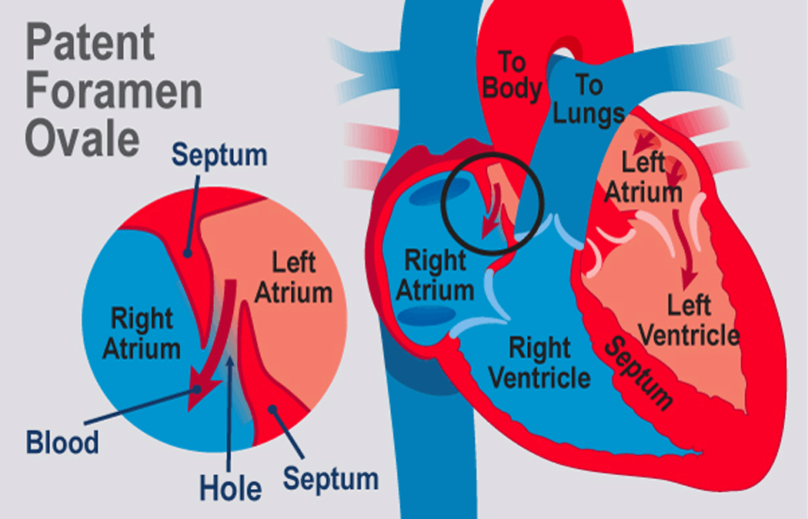

Abstract 
-------

Patent Foramen Ovale(PFO) is one of the most common heart disease in the world. Recent studies show that PFO may causes right-to-left shunt, which will trigger possible paradoxical embolism and stroke. In this work, we propose a novel two-stage classification approach based on spatial and temporal domain for automated diagnosis of PFO. Compared to clinical experts xxx and other deep learning methods, experimental results show that our method achieves x sensitivity, x specificity, and x AUC, which has demonstrated a great promise in the future.

Clinical Background 
-------

### 1.PFO Disease

​                             

​																					Fig1 and Fig2

Fig1.Patent foramen ovale(PFO), a hole located between the left and right atrium, is the consequence of failure to close the foramen ovale. (image source: KidsHealth® All rights reserved). Fig2. The dotted line area is where the PFO exists in 2D echocardiography.

Foramen ovale, a hole in the wall between the left and right atrium of every growing baby’s heart [1], serves as a life channel to deliver blood when baby is not exposed to air. Normally, functional closure occurs in the foramen ovale after baby births. In about 15-35% [2], [3] of the adult population, however, the foramen ovale dose not close, which is termed as patent foramen ovale(PFO). It is the most common congenital heart abnormality of fetal origin and is about ten times higher than bicuspid aortic valve disease, the most widely common adult congenital heart disease [4], [5].

The reasons why PFO fails to close are still unknown, but they may be related to multifactorial inheritance [6]. PFO is experiencing increased clinical interest, because some people with PFO do not show symptoms while for the others, PFO could negatively impact their health, and it may cause right-to-left shunt to trigger possible paradoxical embolism. Previous studies suggested that PFO has been regarded as a risk factor for several serious clinical syndromes, such as ischemic stroke, cryptogenic stroke, migraine headaches, decompression illness[7].

### 2.Clinical Diagnosis

#### 2.1TEE

​                              

​                                                                          Fig3 and Fig4

Fig3. a demo TEE video(copywrited by Cleveland Clinic). Fig4.  a TTE image. The blue shunt at the white arrow indicates the PFO case.

Transesophageal echocardiography(TEE) is considered as the gold standard for PFO while it is a semi-invasive detection which is difficult to operate and requires clinicians’ experience.  This kind of clincial testing method is not popular in china and only large hospitals could carry out such test.

#### 2.2TTE

​                              

​                                                                          Fig5 and Fig6

#### 2.3cTTE

### 3.Difficulties

#TODO1:

### 4.Current Situation

Overall, Diagnosing PFO has great clinical value and significance, but clinicans have been confused by such difficulties mentioned above at present. Clinical diagnosis of PFO is quite complicated, time-consuming and highly dependent on the quality of images and operator experience. In addition, the current gold standard TEE is semi-invasive. Therefore, it is quite necessary to explore other non-invasive and efficient (high test rate) diagnostic methods to screen out PFO-related patients. 

## Our work

### 1.Motivation

1) As for PFO diagnosis, current literatures focus mainly on exploration from clinical perspective while fewer of them from engineering perspective.
2) This study intends to explore the feasibility of artificial intelligence in PFO diagnosis. Our vision is to use artificial intelligence and conventional testing methods to obtain diagnosis results close to the gold standard TEE, providing a non-invasive and reliable test for PFO diagnosis.

### 2.Hypothesis

Inspired by clinical experience and diversity of testing methods, we utilize both TTE and cTTE images of patients and hypothesize that it is considered to be PFO as long as the real bubbles are detected during the first three cardiac cycle in left atrium when performing cTTE.

### 3.Pipline

### 3.Dataset and Data Preprocessing

### 4.Left Atrium Segmentation

​    

### 5.Motion Artifacts Removal

### 6.Bubble detection

### 7.Feature Extraction

